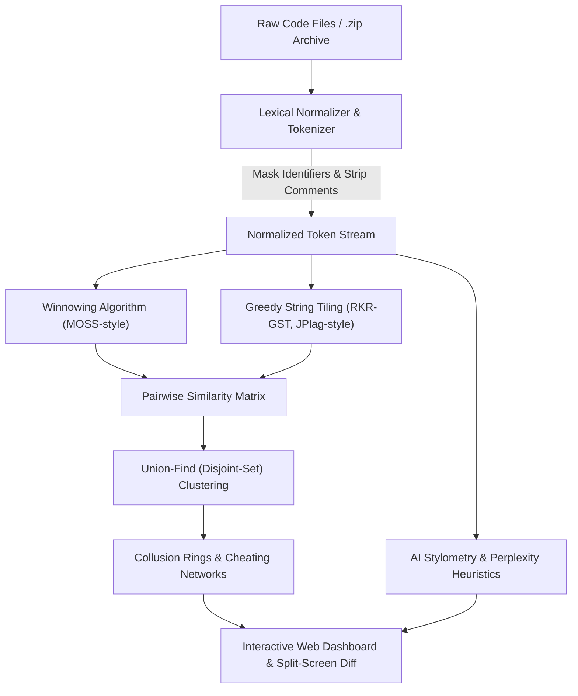

# 🧚‍♀️ Zixie — Code Plagiarism, Collusion & AI Detection Platform

[](https://www.typescriptlang.org/)
[](https://nodejs.org/)
[](https://fastify.dev/)
[](https://react.dev/)
[](https://tailwindcss.com/)
[](LICENSE)

> **Automated structural code integrity, collusion ring clustering, and AI detection for technical assessments.**

---

## ⚡ Problem Statement

During online coding rounds and remote technical interviews, candidates often:
1. **Collude in Groups:** Solve problems together and submit variants with renamed variables and altered comments.
2. **Copy Logic:** Swap statement orders or restructure loops to defeat naive text-diff checkers.
3. **Use Generative AI:** Prompt ChatGPT or Claude to generate solutions containing structured docstrings and textbook naming.

**Zixie** is an end-to-end full-stack platform built to expose these evasion techniques through static analysis, string tiling, and graph theory.

---

## 🏗️ Architecture & Monorepo Layout

```
zixie/
├── packages/
│   ├── engine/          # Algorithmic Core (Tokenizer, Winnowing, RKR-GST, AI Detector, Union-Find)
│   ├── server/          # Fastify Backend REST API (Zip Ingestion, Report Cache, Diff APIs)
│   └── client/          # React 19 + Tailwind Dashboard (Landing Hero, Auth, Welcome, Diff Modal)
├── samples/             # Realistic benchmark test submissions & bundled zip
└── package.json         # Unified npm workspaces
```

---

## 🔬 Algorithmic Pipeline



### 1. Lexical Tokenizer & Masking
* Strips all single-line and multi-line comments.
* Compresses whitespace and line breaks.
* Normalizes user-defined variable and function names to generic `$ID` tokens to neutralize variable-renaming obfuscation.
* Maps token positions back to original source code lines for precise visual diff highlighting.

### 2. Winnowing Algorithm (Stanford MOSS)
* Computes polynomial rolling hashes (Rabin-Karp) over token $k$-grams ($k=8$).
* Uses a sliding window ($w=6$) selecting the minimum hash to generate compact fingerprints.
* Evaluates similarity via the Sorensen-Dice coefficient over fingerprint sets.

### 3. Greedy String Tiling (RKR-GST, JPlag)
* Detects maximal non-overlapping contiguous matching token tiles between candidate submissions.
* Dynamically marks matched tiles to prevent score inflation.
* Finds copied functions even when candidates reorder them.

### 4. Collusion Ring Detection (Union-Find)
* Constructs a graph where nodes represent candidates and edges represent similarity $\ge 70\%$.
* Uses the **Disjoint-Set (Union-Find)** data structure with path compression and union-by-rank to cluster cheating rings into distinct groups.

### 5. AI Detection Pipeline
* Analyzes comment density and structured markers (`Time Complexity: O(...)`, `Initialize variables`, `Base cases`).
* Evaluates canonical variable naming patterns (`currentIndex`, `leftPointer`, `frequencyMap`).
* Assesses indentation discipline and structural uniformity.
* Outputs an **AI Probability Score** ($0 - 100\%$) with rationale.

---

## 🚀 Getting Started

### Prerequisites
* **Node.js** >= 20.0.0 (tested on Node 26)
* **npm** >= 10.0.0

### Installation

```bash
# Clone the repository
git clone https://github.com/abhijeet-rx/Zixie.git
cd Zixie

# Install dependencies across all workspaces
npm install

# Run the test suite
npm run test

# Build all packages
npm run build
```

### Running the Application

Start both the backend API and frontend client with a single command:

```bash
npm run dev
```

* **Frontend Dashboard:** [http://localhost:3000](http://localhost:3000)
* **Fastify API Server:** [http://localhost:4000](http://localhost:4000)

---

## 🧪 Testing with Benchmark Submissions

A pre-packaged benchmark dataset is included in `samples/`:
* **Alice, Bob, and Dave:** 3 candidates who colluded on Binary Search with variable renaming.
* **Charlie:** Honest candidate who wrote QuickSort.
* **Eve:** Honest candidate who wrote a MinHeap.
* **Frank:** Submitted textbook AI-generated code with docstrings and complexity annotations.

### Two Ways to Test:
1. **One-Click Demo:** Open the web dashboard and click **"Reload Benchmark Cohort"**.
2. **Drag-and-Drop:** Drag [`samples/benchmark_submissions.zip`](file:///d:/projects/Zixie/samples/benchmark_submissions.zip) directly into the upload area on the dashboard.

---

## 📋 API Reference

| Endpoint | Method | Description |
| :--- | :--- | :--- |
| `/api/health` | `GET` | Server health check and timestamp |
| `/api/demo` | `GET` | Runs analysis on benchmark cohort |
| `/api/analyze` | `POST` | Accepts multipart `.zip`/files or JSON candidate list |
| `/api/reports/:id` | `GET` | Retrieves full cohort analysis report |
| `/api/reports/:id/compare` | `GET` | Compares two candidates side-by-side with matched line ranges |

---

## 📜 License
MIT © [Abhijeet Singh](https://github.com/abhijeet-rx)
